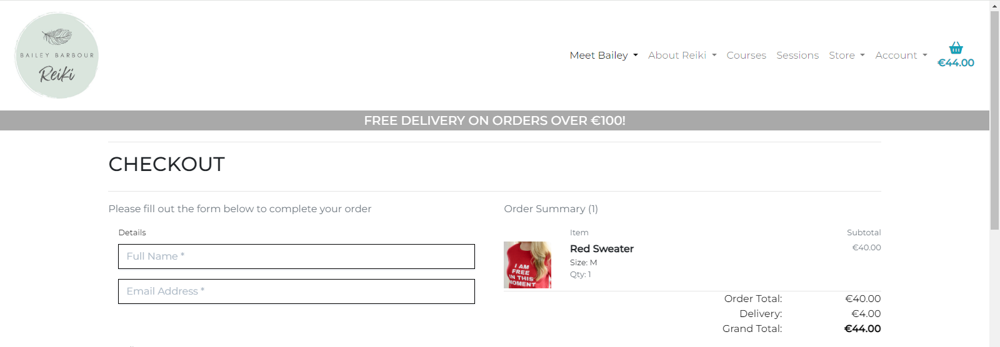

# Bailey Barbour Reiki

  

Bailey Barbour Reiki is a fully functioning e-commerce web application. The site allows users to view & purchase the products & services provided by the business. Users can create accounts, leave reviews, & contact the business using a contact form. The site also enables administrators to add, edit and remove products, as well as view contact enquiries & pre-approve reviews before they appear on the live site.  

To visit the live link to Bailey Barbour Reiki on Heroku click
[here](https://decant09-bailey-barbour-reiki-c1328d81ff2e.herokuapp.com/).  

## Contents
- [Reiki](#reiki)
  - [Contents](#contents)
  - [User Experience](#user-experience)
    - [Initial Discussion](#initial-discussion)
    - [User Stories](#user-stories)
    - [Design](#design)
      - [Colour Scheme](#colour-scheme)
      - [Typography](#typography)
      - [Agile Development](#agile-development)
      - [Wireframes](#wireframes)
      - [Database Schema](#database-schema)
  - [Features](#features)
    - [Future Features](#future-features)
  - [Search Engine Optimization and Social Media Marketing](#search-engine-optimization-and-social-media-marketing)
    - [Keywords](#keywords)
    - [Sitemaps](#sitemaps)
    - [Robots](#robots)
    - [Social Media Marketing](#social-media-marketing)
    - [Newsletter Marketing](#newsletter-marketing)
  - [Technologies Used](#technologies-used)
    - [Languages](#languages)
    - [Frameworks](#frameworks)
    - [Database](#database)
    - [Libraries and Packages](#libraries-and-packages)
    - [Programs](#programs)
  - [Testing](#testing)
    - [W3C Validator](#w3c-validator)
      - [HTML](#html)
      - [CSS](#css)
    - [JShint](#jshint)
      - [JavaScript](#javascript)
    - [PEP8 Validator](#pep8-validator)
      - [Python](#python)
    - [Accessibility](#accessibility)
      - [WebAIM](#webaim)
      - [Google Lighthouse](#google-lighthouse)
    - [Manual](#manual)
      - [Account Registration Tests](#account-registration-tests)
      - [User Navigation Tests](#user-navigation-tests)
      - [Links and Buttons Tests](#links-and-buttons-tests)
      - [Account Security Tests](#account-security-tests)
      - [Post Tests](#post-tests)
      - [Comment Tests](#comment-tests)
      - [Profile Tests](#profile-tests)
      - [Admin Tests](#admin-tests)
    - [Bugs](#bugs)
      - [Known](#known)
      - [Solved](#solved)
  - [Deployment and Local Development](#deployment-and-local-development)
    - [Deployment](#deployment)
    - [Local Development](#local-development)
      - [How to Fork](#how-to-fork)
      - [How to Clone](#how-to-clone)
  - [Credits](#credits)
    - [Code Used](#code-used)
    - [Resources](#resources)
    - [Acknowledgements](#acknowledgements)
## User Experience

### Initial Discussion
This website was created for a project submission to Code Institute for the Diploma in Full Stack Software Development (E-commerce Applications). The criteria for the submission were primarily that it be an E-commerce platform created using the Bootstrap and Django frameworks and utilises the Stripe payment infrastructure to allow users to buy products. I chose Bailey Barbour Reiki & Sound Healing as the business to develop this website for as the business owner had approached me to develop a new website for her.

### User Stories
The projects user stories have been documented on the [GitHub project board](https://github.com/users/decant09/projects/8).

[Back to top](#contents)

### Design
#### Colour Scheme
I opted for a neutral colour scheme throughout the website mainly using greys, whites, and blacks. I opted for this approach to create a calm atmosphere for visitors to the website due to the nature of the business. The default toast message colours were used when displaying messages to the user.
#### Typography
The Montserrat sans-serif font style was chosen for its clean geometric lines and modern aesthetic.
#### Agile Development
An agile development approach was taken to create this project. A project board was created using GitHub Projects. User stories were assigned to epics. MoSCow prioritization was used to prioritize epics and user stories by assigning custom labels that denote a level of importance. Custom milestones were also created to help keep the project on track. Epics and user stories were assigned to the different areas of the kanban depending on their status. The areas were:
- To Do
- In Progress
- Done
- Future Implementation  

The EPICs of the project were:
1. [Planning](https://github.com/decant09/reiki/issues/10)
2. [Navigation](https://github.com/decant09/reiki/issues/5)
3. [Registration, User Accounts & Profiles](https://github.com/decant09/reiki/issues/16)
4. [Cart & Checkout](https://github.com/decant09/reiki/issues/23)
5. [Admin & Store Management](https://github.com/decant09/reiki/issues/29)
6. [Product Views & Sorting](https://github.com/decant09/reiki/issues/33)
7. [FAQ & Contact](https://github.com/decant09/reiki/issues/37)
8. [Newsletter & Blog](https://github.com/decant09/reiki/issues/41)
9. [Reviews](https://github.com/decant09/reiki/issues/45)
10. [SEO](https://github.com/decant09/reiki/issues/49)

The milestones were:
1. [Planning Phase](https://github.com/decant09/reiki/milestone/1)
2. [MVP Release](https://github.com/decant09/reiki/milestone/2)
3. [Complete Additional Features & Submit](https://github.com/decant09/reiki/milestone/3)

The project board can viewed [here](https://github.com/users/decant09/projects/8/views/1) on the GitHub Projects Page.

#### Wireframes
Wireframes were created for the website layout including mobile wireframes for pages that have a significantly different layout to the desktop version.

Some slight layout differences exist between the finished website and the wireframes. For example the biography & review pages on the finished site do not have images.

The blog wireframes were created although in the end this feature does not exist on the finished website.  

Landing Page

Landing Page Mobile

Biography Page

Reviews Page

About Page

Product List Page

Product Detail Page

Product Detail Page Mobile

Add or Update Product Page

Contact Page

FAQ Page

Register Page

Login Page

Logout Page

Profile Page

Cart Page

Cart Page Mobile

Checkout Page

Checkout Success Page

Error Page

Blog List Page

Blog Detail Page

#### Database Schema
Pre-project planning involved generating an entity relationship diagram. This was done in order to create a clear plan as to how all of the database models interact with each other. This was also done to determine what data fields were needed for each model.

Entity Relationship Diagram

  

[Back to top](#contents)

## Features
The main features of the website are documented in this section.

- Navigation
    - The Desktop navigation is available throughout the website. It contains all of the relevant links to allow the user to navigate around the site. Certain links are available to users depending on logged in status or admin status. The logo is a link to the homepage. There is also a cart icon that displays a running total of itmes in the cart. This can be clicked on to take the user to the checkout details page.
        

        
Navbar Admin

        
        

        

        
Navbar New User

        
        

        

        
Navbar Logged in

        
        

    - On mobile the navigation collapses using bootstraps accordion facility.
        

        
Navbar Logged in

        
        

    - Any extra links to pages on the website are located in the footer as well as social media links and a mailchimp newsletter signup facility.
        

        
Footer

        
        

- Authentication
    - The authentication system used is Django Allauth and links to the main login, logout & register pages are found in the account section of the navbar. Appropriate messages are displayed to the user if form fields are not completed correctly and toast messages are displayed in conjuction for success or errors.
        

            
Login Page

            
        

        

            
Login Success

            
        

        

            
Register Page

            
        

        

            
Logout Success

            
        

- Products
    - Products are displayed pages based on the categories of Courses, Sessions, Clothes and accessories. Each product can be clicked on to take the user to the product detail page where the user can add product quantities to the cart.
        

            
Products

            
        

        

            
Product Details

            
        

    - Products can be navigated to using the navbar as shown in a previous image or by using the buttons in the Discover my Products section of the homepage.
        

            
Discover Products

            
        

- Cart
    - The cart contains a list of products that the user has added to their cart and they can also edit quantities or remove items if desired. Messages are displayed to the user in a modal on adding, removing or editing the contents of the cart. The cart also contains a summary of charges charges the user can expect to pay upon checking out.
        

            
Cart Success

            
        

        

            
Cart Details

            
        

        

            
Cart Charges

            
        

- Checkout
    - The checkout page contains the details of the cart and a form to enter information required for the checkout. There is a stripe form located at the bottom for the user to enter card details. The user can also opt to save their details for futures so that the form will be prepopulated for them on their next visit.
        

            
Checkout Details

            
        

        

            
Delivery Form

            
        

        

            
Stripe Form

            
        

    - Once a payment is processed the user is taken to a checkout success page. A success message appears in the modal and the order details are diplayed. A confirmation email is also sent to the user.
        

            
Checkout Success

            
        

        

            
Confirmation Email

            
        

- Webhooks
    - The site uses a webhook system to ensure that the payment process is secure and robust and cannot be interrupted or corrupted, either through user error or malicious intent. Webhooks payment intents are incorporated via the Stripe payment system and are handled on the Stripe website.
        

            
Webhook

            
        

- Profile
    - The profile page contains the users stored delivery information and a history of previous orders. The user can update their information and view order details by clicking on the order number which displays the order details that was presented to them on the checkout success above. When viewing the order details a message is displayed clarifying that this is a previous order and that an email was sent at the time of purchase.
        

            
Profile

            
        

        

            
Order Details

            
        

- Contact
    - The contact form can be accessed by clicking on the discovery call button on the homepage or by clicking the contact link in the footer shown in above footer image. It allows the user to send a message to the website regarding a discovey call or other issues. The message can then be accessed by the admin in the admin panel. A success message lets the user know the form was sent successfully and the form is refreshed with empty fields with the email prepopulated if the user is signed in.
        

            
Discovery Call

            
        

        

            
Contact Form

            
        

        

            
Contact Form Success

            
        

    - In the admin panel the admin can view the message and mark it as responded to.
        

            
Contact Admin

            
        

- Newsletter
    - A newsletter can be subscribed to and the service is implemented using Mailchimp. Once the user enters their email address a success message is displayed and the email address is added to the mail list in the Mailchimp account.
        

            
Newsletter Subscribe

            
        

        

            
Newsletter Audience

            
        

- Reviews
    - Reviews of the business are located on the reviews page in the Meet Bailey dropdown in the navbar. There are also three reviews with homepage boolean field set to true that appear on the homepage. Users, if logged in, can leave a review and a message is displayed informing them that they have successfully left a review and that it will appear once the admin approves it. The review post form is located at the bottom of the reviews page and is only visible to logged in users. Reviews can be managed by the admin in the admin panel where they can approve reviews and change homepage status.
        

            
Reviews

            
        

        

            
Review Form

            
        

        

            
Homepage Reviews

            
        

        

            
Review Success

            
        

        

            
Review Admin

            
        

- FAQ
    - A frequently asked questions page can be accessed from the FAQ footer link. Clicking on a question reveal the answer in a dropdown panel. FAQs can be managed in the admin panel.
        

            
FAQ

            
        

- Manage Products
    - Products can be managed by the admin superuser. This can be access from the navbar Manage Products link as shown above. Here the admin can add products using the form.
        

            
Add Product

            
        

        

            
Add Product

            
        

    - Products can be edited and delted by using the buttons available only to the superuser on the products and product details page. Clicking the edit button displays a form prepopulated with all of the product details.
        

            
Edit or Delete Product

            
        

        

            
Update Product

            
        

        

            
Update Product

            
        

    - Once a product is added or updated using the forms and submitted the page redirects to that product's details page with a success message displayed. 
        

            
Product Success

            
        

        

            
Product Success

            
        

- Additional Information Pages
    - Pages that contain information for the user are also available on the website.
        

            
Biography

            
        

        

            
What is Reiki

            
        

        

            
Benefits

            
        

        

            
Privacy Policy

            
        

        

            
Terms & Conditions

            
        

- Error Pages
    - Custom 404 and 500 error pages are also a feature. They contain a button to take the user back to the homepage. An example of the 404 page is shown here but the 500 page layout is similar.
        

            
404

            
        

- Restrictions
    - Users are redirected from pages they do not have authorization to view. If a user was to manually type the URL for the add products page for example they would be redireted back to the login page.
### Future Features
- The original plan for this website was for there to be blog page where the business owner could upload and manage content as desired. Wireframes were skectched up and the user story for the blog included in the project board however I did not have time to implement this feature. This facility is intended to allow the business owner to post interesting research articles in the field of Reiki and Sound Healing and will be s useful feature in future.
- Although the admin can see messages from the contact form in the admin site it would be better if this was implemented on the frontend with the ability to manage and reply to messages directly there. Therefore this is a feature I would like to implement in the future to improve the utility of the site for the business owner.
- Managing the FAQs from the frontend is also an intended future feature. The business owner could create, update and delete them as desired instead of having to access the Django admin.
- Managing the reviews of the business from the frontend is also an intended future feature. The business owner could decide from the frontend what reviews they want posted on the homepage, approve reviews, or delete them as desired instead of having to access the Django admin.

[Back to top](#contents)

## Search Engine Optimization and Social Media Marketing
In order to improve the business's visibility to search engines I used the approach of generating a list of keywords, a sitemap.xml file, and a robots.txt file. I embedded a newletter signup form in the footer and also provided a links on the website to its Facebook business page and other social media pages. 

### Keywords
Appropriate keywords were used that align with the site. These will help improve the website's visibility and also help users when using online search engines to find the site. I used both short-tail keywords & long-tail keyword phrases.

I have included a screenshot of the head element from my base.html page that shows the keywords within the relevant meta tag.

    
Keywords

    

### Sitemaps
I generated a sitemap.xml file for the site using XML-Sitemaps and included it in the root level of the project repository. This will help search engines crawl the site more effectively.
### Robots
I created a robots.txt at the root level of the project file. This tells search engine crawlers which URLs the crawler can access on the site. This is used mainly to avoid overloading the site with requests.
### Social Media Marketing
Social media marketing is used by this business to help grow an online following and expand the business. The social media outlets utilised are:
- [Facebook](https://www.facebook.com/people/Bailey-Barbour-Reiki/100085606613938/)
- [YouTube](https://www.youtube.com/@baileybarbourreiki)
- [Instagram](https://www.instagram.com/baileybarbourreiki)
- [TikTok](https://www.tiktok.com/@baileybarbourreiki)
- [Insight Timer](https://insighttimer.com/BaileyBarbour)

A screenshot of the facebook business page can be seen below.

    
Facebook

    

### Newsletter Marketing
An embedded mailchimp newsletter form is included in the footer of the website and available throughout the whole site. Users can subscribe to the newletter to hear of any updates or offers. In this way the business can grow an audience and send marketing material their way to improve sales. 

[Back to top](#contents)

##  Technologies Used
### Languages
- HTML5
- CSS3
- JavaScript
- Python3
### Frameworks
- [Django 3.2.22](https://www.djangoproject.com/)
    - Python web framework used to develop the website.
- [Bootstrap](https://getbootstrap.com/docs/5.0/getting-started/introduction/)
    - Responsive CSS framework used to develop the website.
### Database
- [ElephantSQL](https://www.elephantsql.com/)
    - Used to host the PostgreSQL database.
### Libraries and Packages
- [Django Allauth](https://pypi.org/project/django-allauth/)
    - Used for the authentication system.
- [Django Crispy Forms](https://django-crispy-forms.readthedocs.io/en/latest/)
    - Used to control the rendering behaviour of forms.
- [Gunicorn](https://pypi.org/project/gunicorn/)
    - Python WSGI HTTP Server.
- [Psycopg2](https://pypi.org/project/psycopg2/)
    - Python-PostgreSQL Database Adapter.
- [Amazon Web Services](https://aws.amazon.com/)
    - Cloud based image management system used for managing the images.
- [Stripe](https://stripe.com/ie)
    - Used for online secure payments.

### Programs
- [Gitpod](https://www.gitpod.io/)
    - Used as a cloud-based IDE for development.
- [Jinja](https://jinja.palletsprojects.com/en/3.1.x/)
    - Templating engine to allow writing code similar to Python syntax.
- [Heroku](https://www.heroku.com/)
    - Used to deploy the project.
- Git
    - Used for version control by utilising the Codeanywhere terminal to commit to Git and push to GitHub.
- GitHub
    - Used to store the code of the project after being pushed from Git.
- [Icons8](https://icons8.com/icons/set/camera-favicon).
    - Used to obtain the browser icon to be displayed in the browser tab.
- [Convertico](https://convertico.com/).
    - Used to convert a png file to ico file for the favicon.
- [Balsamiq](https://balsamiq.com/)
    - Used to generate the wireframes for the design of the website.
- [Font Awesome](https://fontawesome.com/)
    - Used for the camera logo, github logo, comments, edit and delete icons.
- Google Dev Tools
    - Used for responsiveness investigations, isolating code, troubleshooting, and testing features.
- [Am I Responsive](https://ui.dev/amiresponsive)
    - Used to generate an image to show responsiveness across different device sizes.
- [Pip](https://pypi.org/project/pip/)
    - For installing python packages.
- [XML-Sitemaps](https://www.xml-sitemaps.com)
    - Used to generate the sitemap.xml file.
- [jpg2png](https://jpg2png.com/)
    - To covert large jpg files to png
- [Compressjpg](https://compressjpeg.com/)
    - To reduce large jpg files

[Back to top](#contents)

## Testing

### W3C Validator
#### HTML
- Page (page.html)  
    

    
Result - No errors or warnings to show.

    
    
  

#### CSS
- Style Sheet
    

    
Result - No error found.

    
    
  

### JShint
#### JavaScript
- Script Tags  
    

    
Result - No warnings.

    
    
  

### PEP8 Validator
#### Python
- Project (reiki) urls
    

    
All clear, no errors found.

    
    

- Products urls (etc all .py files)
    

    
All clear, no errors found.

    
    

- 

### Accessibility
#### WebAIM
I tested for contrast with no errors showing. I tested a selection of pages as most pages use the same colour scheme and webaim was not able to access all pages because of login requirements.

Page

#### Google Lighthouse
Google Lighthouse was used to test for accessibility for each page.
- Page (page.html)  
    

    
Result - 100

    
    

[Back to top](#contents)

### Manual
- I used Google Dev Tools to test for screen responsiveness.  
- I tested on different browsers (chrome, firefox, safari and edge) to ensure the website performs as expected across all of these.
- I tested on Android and iPhone devices.
- I used [Grammarly](https://www.grammarly.com/) to spellcheck and check for grammatical errors.
- All features of the website were manually tested and documented in the following sections.

#### Account Registration Tests

| Test |Result  |
|--|--|
| User can create account | Pass |
| User can log into account| Pass |
| User can log out of account| Pass |
| User can not sign up with an email currently in use | Pass |
| User can not sign up with a username currently in use | Pass |

---

#### User Navigation Tests

| Test |Result  |
|--|--|
| User can navigate to Feed | Pass |
| User can navigate to login page | Pass |
| Non logged in user can navigate to register page | Pass |
| Logged in user can access their profile | Pass |
| Logged in user can navigate to logout page | Pass |
| Logo takes user to landing page | Pass |
| SuperUser can access admin panel | Pass |
| 403 page displayed as intended | Pass |
| 404 page displayed as intended | Pass |

---

#### Links and Buttons Tests

| Test |Result  |
|--|--|
| All buttons act as intended | Pass |
| All links act as intended | Pass |
| Image links act as intended | Pass |
| Image modal acts as intended | Pass |

---

#### Account Security Tests

| Test |Result  |
|--|--|
| Non logged in user cannot access profile page | Pass|
| Non superuser cannot access admin panel |Pass|

---

#### Post Tests

| Test |Result  |
|--|--|
| Posts are visible to all users | Pass |
| Only logged in user can create post | Pass |
| Only author of post can edit post | Pass |
| Only author of post can delete post | Pass |
| Deleting a post deletes all of its data and linked comments | Pass |

---

#### Comment Tests

| Test |Result  |
|--|--|
| Only approved comments are visible to all users | Pass |
| Only logged in user can post a comment | Pass |
| Only author of comment can delete comment | Pass |
| Deleting a comment only deletes the comment | Pass |

---

#### Profile Tests

| Test |Result  |
|--|--|
| User can update their username from the profile page | Pass |
| User can update/add a profile image from the profile page | Pass |
| User can update edit their email address from the profile page | Pass |
| User cannot change username to one already in use | Pass|
| User cannot change email to one already in use | Fail |
| Deleting a profile only deletes the profile not the user | Pass |

---

#### Admin Tests

| Test | Result  |
|--|--|
| Admin can add posts | Pass |
| Admin can add comments | Pass |
| Admin can update posts | Pass |
| Admin can update comments | Pass |
| Admin can approve comments | Pass |
| Admin can update profiles | Pass |
| Admin can delete posts | Pass |
| Admin can delete comments | Pass |
| Admin can delete profiles | Pass |
| Admin can delete users | Pass |
| Deleting a user deletes all of their posts and comments also | Pass |

[Back to top](#contents)

### Bugs
#### Known
- When you add a product to the cart that is not subject to a delivery charge and is under the free delivery threshold you still get a message displayed to say spend more to avail of free delivery. Rearranging the code in the toast_success.html file and using an if statement with item.product.delivery_charge == True could be used but I was not able to find the correct structure to implement this. There are a few different scenarios, such the cart having a product with a delivery charge and a product without a delivery charge and the grand total still being under the free delivery threshold. In that case a delivery charge is applicable to one item so the message should still appear.
- Inactive products do not show up on the all products page but they do show up on the page that is filtered by category. I possibly need to introduce an is_active filter to the products in the context in the views.py.
#### Solved
- After applying the logic to filter products by category I was not able to view the page upon clicking on the navbar link. Clicking on the link did not yield any action. The expected action was that the product page would display with the filter applied for the specific category. I realized that there were data-toggle="dropdown" and aria-expanded="False" attributes in the anchor element. The navbar items had previously been dropdowns with these attributes but I had amended them to simple links without removing them. Removing the attributes resolved the issue.
- On the cart page the delivery charge was being calculated and including items that were not subject to delivery charge. After playing around with the code a few times and testing a few different scenarios arose where the delivery charge was not being applied correctly. I had created code within an if block to account for items that had delivery_charge is True. After realising that the location of the if blocks were not indented correctly I amended their position and this resolved the error.
- The MEDIA_URL template was not working for products with no images. This was because the contexts processor was not included in the templates settings. 
- When trying to link the static css file for the checkout app to the checkout.html page it was not working. This was due to the fact that my file structure was incorrect. I was missing a checkout folder within the static folder. I entered the css folder with the checkout.css file into this folder and the issue recolved.
[Back to top](#contents)

## Deployment and Local Development
### Deployment
The site was deployed to Heroku and the following steps were followed to do so:

- Login to your [Heroku](https://www.heroku.com/) account, or create an account.
- To create a new app click the "New" button in the upper right hand corner and select "Create new app".
- Choose an app name, select your region and click "Create app". The app is created to return to later.
- Next a [Cloudinary](https://cloudinary.com/) account will be required as Cloudinary is used to host the images of the website.
- Login into Cloudinary or you can create an account for free.
- Navigate to the dashboard and copy and store the value of the "API Environment Variable" and be sure to include cloudinary:// at the start, this will be used in the Heroku Config Vars.
- An [ElephantSQL](https://www.elephantsql.com/) account will be required as ElephantSQL is used to host the database.
- Login to ElephantSQL or create an account for free.
- Click on "Create New Instance".
- Name your instance, select the Tiny Turtle plan which is free, and leave the input tags blank.
- Select the region and choose the nearest data centre to your location.
- Click "Review" and then click "Create instance" if details are as intended.
- In the Instances section click on the instance name that was just created.
- In the Details section click on the copy icon located next to the URL. This will be used in the Heroku Config Vars.
- Back in Heroku select the app that you just set up.
- In the settings tab of the app click on "Reveal Config Vars" and store the required config var keys and values as below:
    - CLOUDINARY_URL: *Cloudinary URL as obtained above*
    - DATABASE_URL: *ElephantSQL postgres database URL as obtained above*
    - PORT: 8000
    - DISABLE_COLLECTSTATIC: 1 (This is left in place during development but must be removed befored deployment)
- Now, in your development environment, inside the Django app repository, create a new file called env.py. Within this file import the os library and set the environment variable for the CLOUDINARY_URL and DATABASE_URL as:
     - os.environ["CLOUDINARY_URL"]= "*Cloudinary URL as obtained above*"
     - os.environ["DATABASE_URL"]= "*ElephantSQL postgres database URL as obtained above*"
- Add a secret key to the app using:
    - os.environ["SECRET_KEY"] = "*your secret key goes here*"
- Add the secret key just created to the Heroku Config Vars as SECRET_KEY for the KEY value and the secret key value you created as the VALUE.
- In the settings.py file within the django app, import Path from pathlib, import os and import dj_database_url.
- Insert the line:
  - if os.path.isfile("env.py"): iport env
- Remove the insecure secret key that django has in the settings file by default and replace it with:
  - SECRET_KEY = os.environ.get('SECRET_KEY').
- Replace the databases section with:
  - DATABASES = { 'default': dj_database_url.parse(os.environ.get("DATABASE_URL"))}
- Ensure the correct indentation for python is used.
- In the terminal migrate the models over to the new database connection using `python3 manage.py makemigrations` and `python3 manage.py migrate`.
- Add the cloudinary libraries to the list of installed apps, the order they are inserted is important, 'cloudinary_storage' goes above 'django.contrib.staitcfiles' and 'cloudinary' goes below it.
- In the Settings.py file - add the STATIC files settings - the url, storage path, directory path, root path, media url and default file storage path.
- Link the file to the templates directory in Heroku TEMPLATES_DIR = os.path.join(BASE_DIR, 'templates').
- Change the templates directory to TEMPLATES_DIR - 'DIRS': [TEMPLATES_DIR].
- Add Heroku to the ALLOWED_HOSTS list, the format will be the app name given in Heroku when creating the app followed by ".herokuapp.com".
- In your code editor, create three new top level folders, media, static, templates.
- Create a new file on the top level directory - Procfile.
- Within the Procfile add the code:
  - web: guincorn PROJECT_NAME.wsgi
- Set up your requiremtnts.txt file to save the libraries that will need to be installed by running the following command in the terminal:
  - `pip freeze -> requiremnts.txt`.
- In the terminal, add the changed files, commit and push to GitHub.
- In Heroku, navigate to the deployment tab and deploy the branch manually - watch the build logs for any errors.
- Heroku will now build the app for you. Once it has completed the build process you will see a 'Your App Was Successfully Deployed' message and a link to the app to visit the [live site](https://decant09-bokeh-photo-blog-0c5a394f8c26.herokuapp.com/).

### Local Development
The steps below describe how to fork or clone the repository if desired.
#### How to Fork
1. Log in to Github.
2. Navigate to the [repository](https://github.com/decant09/bokeh) for this website.
3. Click the Fork button in the top right corner.
4. You will be brought to a new page with a short form to be completed.
5. Upon completing, click on the "Create fork" button and this will create a fork of the repository in your personal account.

#### How to Clone
1. Log in to GitHub.
2. Navigate to the [repository](https://github.com/decant09/bokeh) for this website.
3. Click on the Code button and a modal will appear.
4. Within this modal select the local tab.
5. Within this tab there are HTTPS, SSH, or GitHub CLI tabs.
6. Click on the HTTPS tab and copy the link shown.
7. In your development environment open the terminal.
8. Change the current working directory to the location where you want the cloned directory to be.
9. Type `git clone` into the terminal, then paste the URL you copied in step 6.
10. Press **Enter** to create your local clone.
11. In the terminal install the requirements by using the following: `pip3 install -r requirements.txt`.
12. If you have your own packages that have been installed, then the requirements file needs updated using: `pip3 freeze --local > requirements.txt`.
13. Next create the env.py file which tells our project which variables to use.
14. Add the file to a .gitignore to prevent it from being pushed to github.
15. Start the Django app: `python3 manage.py runserver`.
16. Make migrations by running : `python3 manage.py makemigrations`
17. Then migrate those changes with `python3 manage.py migrate`
18. To run the project type python manage.py runserver into the terminal and open port 8000.
19. This will open the project locally for you to work on.

[Back to top](#contents)

## Credits
### Code Used
- To properly caluclate delivery charges in the Order model for the update_total function I used the code from Emma Hewson's Island Bees project on (GitHub)[https://github.com/emmahewson/island-bees/blob/main/checkout/models.py]. 
### Resources
- Django import statements were too long for PEP8 so used parentheses as per [stackoverflow](https://stackoverflow.com/questions/17273847/long-imports-in-python).
- Reiki FAQ content from (reiki.org)[https://www.reiki.org/faqs].

### Acknowledgements
- My Mentor Chris Quinn for continuous helpful feedback.
- Tutor support at Code Institute for their amazing support.
- Alan Bushell at Code Institute for guiding the class in our weekly stand-ups.

[Back to top](#contents)
