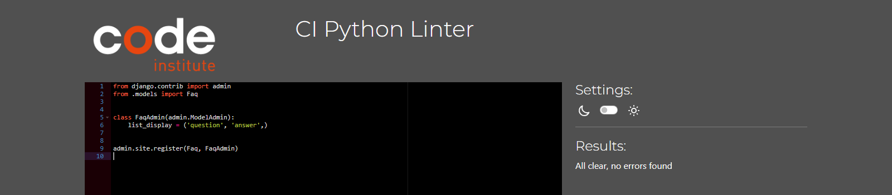
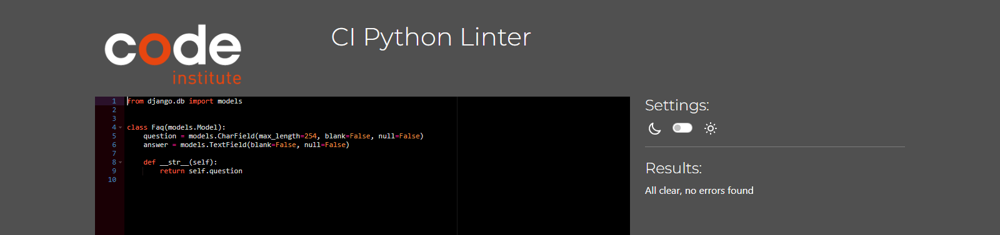
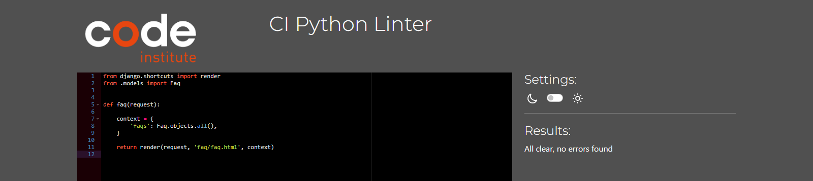
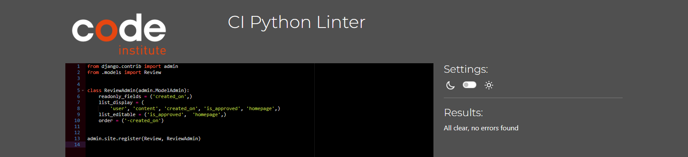
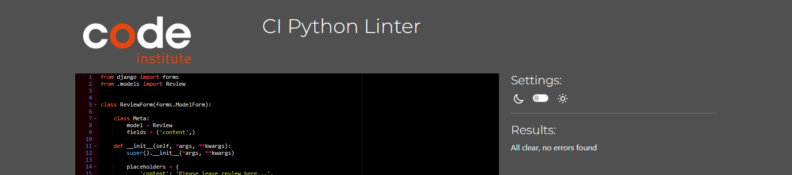

# Bailey Barbour Reiki

  

Bailey Barbour Reiki is a fully functioning e-commerce web application. The site allows users to view & purchase the products & services provided by the business. Users can create accounts, leave reviews, & contact the business using a contact form. The site also enables administrators to add, edit and remove products, as well as view contact enquiries & pre-approve reviews before they appear on the live site.  

To visit the live link to Bailey Barbour Reiki on Heroku click
[here](https://decant09-bailey-barbour-reiki-c1328d81ff2e.herokuapp.com/).  

## Contents
- [Reiki](#reiki)
  - [Contents](#contents)
  - [User Experience](#user-experience)
    - [Initial Discussion](#initial-discussion)
    - [User Stories](#user-stories)
    - [Design](#design)
      - [Colour Scheme](#colour-scheme)
      - [Typography](#typography)
      - [Agile Development](#agile-development)
      - [Wireframes](#wireframes)
      - [Database Schema](#database-schema)
  - [Features](#features)
    - [Future Features](#future-features)
  - [Business Model](#business-model)
  - [Search Engine Optimization and Social Media Marketing](#search-engine-optimization-and-social-media-marketing)
    - [Keywords](#keywords)
    - [Sitemaps](#sitemaps)
    - [Robots](#robots)
    - [Social Media Marketing](#social-media-marketing)
    - [Newsletter Marketing](#newsletter-marketing)
  - [Technologies Used](#technologies-used)
    - [Languages](#languages)
    - [Frameworks](#frameworks)
    - [Database](#database)
    - [Libraries and Packages](#libraries-and-packages)
    - [Programs](#programs)
  - [Testing](#testing)
    - [W3C Validator](#w3c-validator)
      - [HTML](#html)
      - [CSS](#css)
    - [JShint](#jshint)
      - [JavaScript](#javascript)
    - [PEP8 Validator](#pep8-validator)
      - [Python](#python)
    - [Accessibility](#accessibility)
      - [WebAIM](#webaim)
      - [Google Lighthouse](#google-lighthouse)
    - [Manual](#manual)
      - [Account Registration Tests](#account-registration-tests)
      - [User Navigation Tests](#user-navigation-tests)
      - [Links and Buttons Tests](#links-and-buttons-tests)
      - [Account Security Tests](#account-security-tests)
      - [Payments Tests](#payments-tests)
      - [Toast Messages Tests](#toast-messages-tests)
      - [Profile Tests](#profile-tests)
      - [Admin Tests](#admin-tests)
    - [Bugs](#bugs)
      - [Known](#known)
      - [Solved](#solved)
  - [Deployment and Local Development](#deployment-and-local-development)
    - [ElephantSQL Database](#elephant-sql)
    - [Amazon AWS](#amazon-aws)
      - [S3 Bucket](#s3-bucket)
      - [IAM](#iam)
      - [Final AWS Setup](#final-aws-setup)
    - [Stripe API](#stripe-api)
    - [Gmail API](#gmail-api)
    - [Heroku Deployment](#)
    - [Local Development](#local-development)
      - [How to Fork](#how-to-fork)
      - [How to Clone](#how-to-clone)
  - [Credits](#credits)
    - [Code Used](#code-used)
    - [Resources](#resources)
    - [Acknowledgements](#acknowledgements)
## User Experience

### Initial Discussion
This website was created for a project submission to Code Institute for the Diploma in Full Stack Software Development (E-commerce Applications). The criteria for the submission were primarily that it be an E-commerce platform created using the Bootstrap and Django frameworks and utilises the Stripe payment infrastructure to allow users to buy products. I chose Bailey Barbour Reiki & Sound Healing as the business to develop this website for as the business owner had approached me to develop a new website for her.

### User Stories
The projects user stories have been documented on the [GitHub project board](https://github.com/users/decant09/projects/8).

[Back to top](#contents)

### Design
#### Colour Scheme
I opted for a neutral colour scheme throughout the website mainly using greys, whites, and blacks. I opted for this approach to create a calm atmosphere for visitors to the website due to the nature of the business. The default toast message colours were used when displaying messages to the user.
#### Typography
The Montserrat sans-serif font style was chosen for its clean geometric lines and modern aesthetic.
#### Agile Development
An agile development approach was taken to create this project. A project board was created using GitHub Projects. User stories were assigned to epics. MoSCow prioritization was used to prioritize epics and user stories by assigning custom labels that denote a level of importance. Custom milestones were also created to help keep the project on track. Epics and user stories were assigned to the different areas of the kanban depending on their status. The areas were:
- To Do
- In Progress
- Done
- Future Implementation  

The EPICs of the project were:
1. [Planning](https://github.com/decant09/reiki/issues/10)
2. [Navigation](https://github.com/decant09/reiki/issues/5)
3. [Registration, User Accounts & Profiles](https://github.com/decant09/reiki/issues/16)
4. [Cart & Checkout](https://github.com/decant09/reiki/issues/23)
5. [Admin & Store Management](https://github.com/decant09/reiki/issues/29)
6. [Product Views & Sorting](https://github.com/decant09/reiki/issues/33)
7. [FAQ & Contact](https://github.com/decant09/reiki/issues/37)
8. [Newsletter & Blog](https://github.com/decant09/reiki/issues/41)
9. [Reviews](https://github.com/decant09/reiki/issues/45)
10. [SEO](https://github.com/decant09/reiki/issues/49)

The milestones were:
1. [Planning Phase](https://github.com/decant09/reiki/milestone/1)
2. [MVP Release](https://github.com/decant09/reiki/milestone/2)
3. [Complete Additional Features & Submit](https://github.com/decant09/reiki/milestone/3)

The project board can viewed [here](https://github.com/users/decant09/projects/8/views/1) on the GitHub Projects Page.

#### Wireframes
Wireframes were created for the website layout including mobile wireframes for pages that have a significantly different layout to the desktop version.

Some slight layout differences exist between the finished website and the wireframes. For example the biography & review pages on the finished site do not have images.

The blog wireframes were created although in the end this feature does not exist on the finished website.  
<details>
<summary>Landing Page</summary>

</details>
<details>
<summary>Landing Page Mobile</summary>

</details>
<details>
<summary>Biography Page</summary>

</details>
<details>
<summary>Reviews Page</summary>

</details>
<details>
<summary>About Page</summary>

</details>
<details>
<summary>Product List Page</summary>

</details>
<details>
<summary>Product Detail Page</summary>

</details>
<details>
<summary>Product Detail Page Mobile</summary>

</details>
<details>
<summary>Add or Update Product Page</summary>

</details>
<details>
<summary>Contact Page</summary>

</details>
<details>
<summary>FAQ Page</summary>

</details>
<details>
<summary>Register Page</summary>

</details>
<details>
<summary>Login Page</summary>

</details>
<details>
<summary>Logout Page</summary>

</details>
<details>
<summary>Profile Page</summary>

</details>
<details>
<summary>Cart Page</summary>

</details>
<details>
<summary>Cart Page Mobile</summary>

</details>
<details>
<summary>Checkout Page</summary>

</details>
<details>
<summary>Checkout Success Page</summary>

</details>
<details>
<summary>Error Page</summary>

</details>
<details>
<summary>Blog List Page</summary>

</details>
<details>
<summary>Blog Detail Page</summary>

</details>

#### Database Schema
Pre-project planning involved generating an entity relationship diagram. This was done in order to create a clear plan as to how all of the database models interact with each other. This was also done to determine what data fields were needed for each model. The Blog model was not implemented in this project due to time contraints. The relationship between each model and another is noted in the diagram with "FK" denoting Foreign Key. A One To One relationship exists between the User model and the UserProfile model.
<details>
<summary>Entity Relationship Diagram</summary>

</details>  

[Back to top](#contents)

## Features
The main features of the website are documented in this section.

- Navigation
    - The Desktop navigation is available throughout the website. It contains all of the relevant links to allow the user to navigate around the site. Certain links are available to users depending on logged in status or admin status. The logo is a link to the homepage. There is also a cart icon that displays a running total of itmes in the cart. This can be clicked on to take the user to the checkout details page.
        <details>
        <summary>Navbar Admin</summary>
        
        </details>
        <details>
        <summary>Navbar New User</summary>
        
        </details>
        <details>
        <summary>Navbar Logged in</summary>
        
        </details>
    - On mobile the navigation collapses using bootstraps accordion facility.
        <details>
        <summary>Navbar Logged in</summary>
        
        </details>
    - Any extra links to pages on the website are located in the footer as well as social media links and a mailchimp newsletter signup facility.
        <details>
        <summary>Footer</summary>
        
        </details>
- Authentication
    - The authentication system used is Django Allauth and links to the main login, logout & register pages are found in the account section of the navbar. Appropriate messages are displayed to the user if form fields are not completed correctly and toast messages are displayed in conjuction for success or errors.
        <details>
            <summary>Login Page</summary>
            
        </details>
        <details>
            <summary>Login Success</summary>
            
        </details>
        <details>
            <summary>Register Page</summary>
            
        </details>
        <details>
            <summary>Logout Success</summary>
            
        </details>
- Products
    - Products are displayed pages based on the categories of Courses, Sessions, Clothes and accessories. Each product can be clicked on to take the user to the product detail page where the user can add product quantities to the cart.
        <details>
            <summary>Products</summary>
            
        </details>
        <details>
            <summary>Product Details</summary>
            
        </details>
    - Products can be navigated to using the navbar as shown in a previous image or by using the buttons in the Discover my Products section of the homepage.
        <details>
            <summary>Discover Products</summary>
            
        </details>
- Cart
    - The cart contains a list of products that the user has added to their cart and they can also edit quantities or remove items if desired. Messages are displayed to the user in a modal on adding, removing or editing the contents of the cart. The cart also contains a summary of charges charges the user can expect to pay upon checking out.
        <details>
            <summary>Cart Success</summary>
            
        </details>
        <details>
            <summary>Cart Details</summary>
            
        </details>
        <details>
            <summary>Cart Charges</summary>
            
        </details>
- Checkout
    - The checkout page contains the details of the cart and a form to enter information required for the checkout. There is a stripe form located at the bottom for the user to enter card details. The user can also opt to save their details for futures so that the form will be prepopulated for them on their next visit.
        <details>
            <summary>Checkout Details</summary>
            
        </details>
        <details>
            <summary>Delivery Form</summary>
            
        </details>
        <details>
            <summary>Stripe Form</summary>
            
        </details>
    - Once a payment is processed the user is taken to a checkout success page. A success message appears in the modal and the order details are diplayed. A confirmation email is also sent to the user.
        <details>
            <summary>Checkout Success</summary>
            
        </details>
        <details>
            <summary>Confirmation Email</summary>
            
        </details>
- Webhooks
    - The site uses a webhook system to ensure that the payment process is secure and robust and cannot be interrupted or corrupted, either through user error or malicious intent. Webhooks payment intents are incorporated via the Stripe payment system and are handled on the Stripe website.
        <details>
            <summary>Webhook</summary>
            
        </details>
- Profile
    - The profile page contains the users stored delivery information and a history of previous orders. The user can update their information and view order details by clicking on the order number which displays the order details that was presented to them on the checkout success above. When viewing the order details a message is displayed clarifying that this is a previous order and that an email was sent at the time of purchase.
        <details>
            <summary>Profile</summary>
            
        </details>
        <details>
            <summary>Order Details</summary>
            
        </details>
- Contact
    - The contact form can be accessed by clicking on the discovery call button on the homepage or by clicking the contact link in the footer shown in above footer image. It allows the user to send a message to the website regarding a discovey call or other issues. The message can then be accessed by the admin in the admin panel. A success message lets the user know the form was sent successfully and the form is refreshed with empty fields with the email prepopulated if the user is signed in.
        <details>
            <summary>Discovery Call</summary>
            
        </details>
        <details>
            <summary>Contact Form</summary>
            
        </details>
        <details>
            <summary>Contact Form Success</summary>
            
        </details>
    - In the admin panel the admin can view the message and mark it as responded to.
        <details>
            <summary>Contact Admin</summary>
            
        </details>
- Newsletter
    - A newsletter can be subscribed to and the service is implemented using Mailchimp. Once the user enters their email address a success message is displayed and the email address is added to the mail list in the Mailchimp account.
        <details>
            <summary>Newsletter Subscribe</summary>
            
        </details>
        <details>
            <summary>Newsletter Audience</summary>
            
        </details>
- Reviews
    - Reviews of the business are located on the reviews page in the Meet Bailey dropdown in the navbar. There are also three reviews with homepage boolean field set to true that appear on the homepage. Users, if logged in, can leave a review and a message is displayed informing them that they have successfully left a review and that it will appear once the admin approves it. The review post form is located at the bottom of the reviews page and is only visible to logged in users. Reviews can be managed by the admin in the admin panel where they can approve reviews and change homepage status.
        <details>
            <summary>Reviews</summary>
            
        </details>
        <details>
            <summary>Review Form</summary>
            
        </details>
        <details>
            <summary>Homepage Reviews</summary>
            
        </details>
        <details>
            <summary>Review Success</summary>
            
        </details>
        <details>
            <summary>Review Admin</summary>
            
        </details>
- FAQ
    - A frequently asked questions page can be accessed from the FAQ footer link. Clicking on a question reveal the answer in a dropdown panel. FAQs can be managed in the admin panel.
        <details>
            <summary>FAQ</summary>
            
        </details>
- Manage Products
    - Products can be managed by the admin superuser. This can be access from the navbar Manage Products link as shown above. Here the admin can add products using the form.
        <details>
            <summary>Add Product</summary>
            
        </details>
        <details>
            <summary>Add Product</summary>
            
        </details>
    - Products can be edited and delted by using the buttons available only to the superuser on the products and product details page. Clicking the edit button displays a form prepopulated with all of the product details.
        <details>
            <summary>Edit or Delete Product</summary>
            
        </details>
        <details>
            <summary>Update Product</summary>
            
        </details>
        <details>
            <summary>Update Product</summary>
            
        </details>
    - Once a product is added or updated using the forms and submitted the page redirects to that product's details page with a success message displayed. 
        <details>
            <summary>Product Success</summary>
            
        </details>
        <details>
            <summary>Product Success</summary>
            
        </details>
- Additional Information Pages
    - Pages that contain information for the user are also available on the website.
        <details>
            <summary>Biography</summary>
            
        </details>
        <details>
            <summary>What is Reiki</summary>
            
        </details>
        <details>
            <summary>Benefits</summary>
            
        </details>
        <details>
            <summary>Privacy Policy</summary>
            
        </details>
        <details>
            <summary>Terms & Conditions</summary>
            
        </details>
- Error Pages
    - Custom 404 and 500 error pages are also a feature. They contain a button to take the user back to the homepage. An example of the 404 page is shown here but the 500 page layout is similar.
        <details>
            <summary>404</summary>
            
        </details>
- Restrictions
    - Users are redirected from pages they do not have authorization to view. If a user was to manually type the URL for the add products page for example they would be redireted back to the login page.
### Future Features
- The original plan for this website was for there to be blog page where the business owner could upload and manage content as desired. Wireframes were skectched up and the user story for the blog included in the project board however I did not have time to implement this feature. This facility is intended to allow the business owner to post interesting research articles in the field of Reiki and Sound Healing and will be s useful feature in future.
- Although the admin can see messages from the contact form in the admin site it would be better if this was implemented on the frontend with the ability to manage and reply to messages directly there. Therefore this is a feature I would like to implement in the future to improve the utility of the site for the business owner.
- Managing the FAQs from the frontend is also an intended future feature. The business owner could create, update and delete them as desired instead of having to access the Django admin.
- Managing the reviews of the business from the frontend is also an intended future feature. The business owner could decide from the frontend what reviews they want posted on the homepage, approve reviews, or delete them as desired instead of having to access the Django admin.

[Back to top](#contents)

## Business Model
This website uses a business to customer model because it sells services and goods to customers. The business model consists of using social media including Instagram, Tiktok, Youtube and Facebook to drive traffic to the website where purchases can be made by the consumer. There is an option to sign up for a newsletter and the business is steadily growing their email list for marketing purposes. Email marketing includes selling courses, events, and 1:1 client services, as well as, updating subscribers about new free content on the business’s Youtube channel.

## Search Engine Optimization and Social Media Marketing
In order to improve the business's visibility to search engines I used the approach of generating a list of keywords, a sitemap.xml file, and a robots.txt file. I embedded a newletter signup form in the footer and also provided a links on the website to its Facebook business page and other social media pages. 

### Keywords
Appropriate keywords were used that align with the site. These will help improve the website's visibility and also help users when using online search engines to find the site. I used both short-tail keywords & long-tail keyword phrases.

I have included a screenshot of the head element from my base.html page that shows the keywords within the relevant meta tag.

<details>
    <summary>Keywords</summary>
    
</details>

### Sitemaps
I generated a sitemap.xml file for the site using XML-Sitemaps and included it in the root level of the project repository. This will help search engines crawl the site more effectively.
### Robots
I created a robots.txt at the root level of the project file. This tells search engine crawlers which URLs the crawler can access on the site. This is used mainly to avoid overloading the site with requests.
### Social Media Marketing
Social media marketing is used by this business to help grow an online following and expand the business. The social media outlets utilised are:
- [Facebook](https://www.facebook.com/people/Bailey-Barbour-Reiki/100085606613938/)
- [YouTube](https://www.youtube.com/@baileybarbourreiki)
- [Instagram](https://www.instagram.com/baileybarbourreiki)
- [TikTok](https://www.tiktok.com/@baileybarbourreiki)
- [Insight Timer](https://insighttimer.com/BaileyBarbour)

A screenshot of the facebook business page can be seen below.
<details>
    <summary>Facebook</summary>
    
</details>

### Newsletter Marketing
An embedded mailchimp newsletter form is included in the footer of the website and available throughout the whole site. Users can subscribe to the newletter to hear of any updates or offers. In this way the business can grow an audience and send marketing material their way to improve sales. 

[Back to top](#contents)

##  Technologies Used
### Languages
- HTML5
- CSS3
- JavaScript
- Python3
### Frameworks
- [Django 3.2.22](https://www.djangoproject.com/)
    - Python web framework used to develop the website.
- [Bootstrap](https://getbootstrap.com/docs/5.0/getting-started/introduction/)
    - Responsive CSS framework used to develop the website.
### Database
- [ElephantSQL](https://www.elephantsql.com/)
    - Used to host the PostgreSQL database.
### Libraries and Packages
- [Django Allauth](https://pypi.org/project/django-allauth/)
    - Used for the authentication system.
- [Django Crispy Forms](https://django-crispy-forms.readthedocs.io/en/latest/)
    - Used to control the rendering behaviour of forms.
- [Gunicorn](https://pypi.org/project/gunicorn/)
    - Python WSGI HTTP Server.
- [Psycopg2](https://pypi.org/project/psycopg2/)
    - Python-PostgreSQL Database Adapter.
- [Amazon Web Services](https://aws.amazon.com/)
    - Cloud based image management system used for managing the images.
- [Stripe](https://stripe.com/ie)
    - Used for online secure payments.
### Programs
- [Gitpod](https://www.gitpod.io/)
    - Used as a cloud-based IDE for development.
- [Jinja](https://jinja.palletsprojects.com/en/3.1.x/)
    - Templating engine to allow writing code similar to Python syntax.
- [Heroku](https://www.heroku.com/)
    - Used to deploy the project.
- Git
    - Used for version control by utilising the Codeanywhere terminal to commit to Git and push to GitHub.
- GitHub
    - Used to store the code of the project after being pushed from Git.
- [Icons8](https://icons8.com/icons/set/camera-favicon).
    - Used to obtain the browser icon to be displayed in the browser tab.
- [Convertico](https://convertico.com/).
    - Used to convert a png file to ico file for the favicon.
- [Balsamiq](https://balsamiq.com/)
    - Used to generate the wireframes for the design of the website.
- [Font Awesome](https://fontawesome.com/)
    - Used for the camera logo, github logo, comments, edit and delete icons.
- Google Dev Tools
    - Used for responsiveness investigations, isolating code, troubleshooting, and testing features.
- [Am I Responsive](https://ui.dev/amiresponsive)
    - Used to generate an image to show responsiveness across different device sizes.
- [Pip](https://pypi.org/project/pip/)
    - For installing python packages.
- [XML-Sitemaps](https://www.xml-sitemaps.com)
    - Used to generate the sitemap.xml file.
- [jpg2png](https://jpg2png.com/)
    - To covert large jpg files to png.
- [Compressjpg](https://compressjpeg.com/)
    - To reduce large jpg files
- [Canva](https://www.canva.com)
    - Used to create the logo.
- [Mailchimp](https://mailchimp.com/)
    - Used to embed and implement the newletter signup feature.

[Back to top](#contents)

## Testing

### W3C Validator
#### HTML
- Benefits  
    <details>
    <summary>Result - No errors</summary>
    
    </details>  
- Biography
    <details>
    <summary>Result - No errors</summary>
    
    </details>  
- Cart
    <details>
    <summary>Result - No errors</summary>
    
    </details>  
- Checkout Success
    <details>
    <summary>Result - No errors</summary>
    
    </details>  
- Checkout
    <details>
    <summary>Result - No errors</summary>
    
    </details>  
- Contact
    <details>
    <summary>Result - No errors</summary>
    
    </details>  
- FAQ
    <details>
    <summary>Result - No errors</summary>
    
    </details>  
- Index
    <details>
    <summary>Result - No errors</summary>
    
    </details>  
- Privacy Policy
    <details>
    <summary>Result - No errors</summary>
    
    </details>  
- Product Add
    <details>
    <summary>Result - No errors</summary>
    
    </details>  
- Product Details
    <details>
    <summary>Result - No errors</summary>
    
    </details>  
- Product Edit
    <details>
    <summary>Result - No errors</summary>
    
    </details>  
- Products
    <details>
    <summary>Result - No errors</summary>
    
    </details>  
- Profile
    <details>
    <summary>Result - No errors</summary>
    
    </details>  
- Review
    <details>
    <summary>Result - No errors</summary>
    
    </details>  
- Terms & Conditions
    <details>
    <summary>Result - No errors</summary>
    
    </details>  
- What is Reiki
    <details>
    <summary>Result - No errors</summary>
    
    </details>  

#### CSS
- Base
    <details>
    <summary>Result - No error found.</summary>
    
    </details>  
- Checkout
    <details>
    <summary>Result - No error found.</summary>
    
    </details>  
- Profile
    <details>
    <summary>Result - No error found.</summary>
    
    </details>  

### JShint
#### JavaScript
- Countryfield  
    <details>
    <summary>Result - No warnings.</summary>
    
    </details>  
- Quantity Input  
    <details>
    <summary>Result - Seven warnings.</summary>
    
    </details>  
- Stripe Elements  
    <details>
    <summary>Result - One undefined variable Stripe.</summary>
    
    </details>  

### PEP8 Validator
#### Python
- Cart apps.py
    <details>
    <summary>All clear, no errors found.</summary>
    
    </details>
- Cart contexts.py
    <details>
    <summary>All clear, no errors found.</summary>
    
    </details>
- Cart urls.py
    <details>
    <summary>All clear, no errors found.</summary>
    
    </details>
- Cart views.py
    <details>
    <summary>All clear, no errors found.</summary>
    
    </details>
- Checkout admin.py
    <details>
    <summary>All clear, no errors found.</summary>
    
    </details>
- Checkout apps.py
    <details>
    <summary>All clear, no errors found.</summary>
    
    </details>
- Checkout forms.py
    <details>
    <summary>All clear, no errors found.</summary>
    
    </details>
- Checkout init.py
    <details>
    <summary>All clear, no errors found.</summary>
    
    </details>
- Checkout models.py
    <details>
    <summary>All clear, no errors found.</summary>
    
    </details>
- Checkout signals.py
    <details>
    <summary>All clear, no errors found.</summary>
    
    </details>
- Checkout urls.py
    <details>
    <summary>All clear, no errors found.</summary>
    
    </details>
- Checkout views.py
    <details>
    <summary>72: E501 line too long (81 > 79 characters) - required to function correctly.</summary>
    
    </details>
- Checkout webhook_handler.py
    <details>
    <summary>142: E501 line too long (81 > 79 characters) - required to function correctly.</summary>
    
    </details>
- Checkout webhook.py
    <details>
    <summary>All clear, no errors found.</summary>
    
    </details>
- Contact admin.py
    <details>
    <summary>All clear, no errors found.</summary>
    
    </details>
- Contact apps.py
    <details>
    <summary>All clear, no errors found.</summary>
    
    </details>
- Contact forms.py
    <details>
    <summary>All clear, no errors found.</summary>
    
    </details>
- Contact models.py
    <details>
    <summary>All clear, no errors found.</summary>
    
    </details>
- Contact urls.py
    <details>
    <summary>All clear, no errors found.</summary>
    
    </details>
- Contact views.py
    <details>
    <summary>All clear, no errors found.</summary>
    
    </details>
- custom_storages.py
    <details>
    <summary>All clear, no errors found.</summary>
    
    </details>
- Faq admin.py
    <details>
    <summary>All clear, no errors found.</summary>
    
    </details>
- Faq apps.py
    <details>
    <summary>All clear, no errors found.</summary>
    
    </details>
- Faq models.py
    <details>
    <summary>All clear, no errors found.</summary>
    
    </details>
- Faq urls.py
    <details>
    <summary>All clear, no errors found.</summary>
    
    </details>
- Faq views.py
    <details>
    <summary>All clear, no errors found.</summary>
    
    </details>
- Home apps.py
    <details>
    <summary>All clear, no errors found.</summary>
    
    </details>
- Home views.py
    <details>
    <summary>All clear, no errors found.</summary>
    
    </details>
- manage.py
    <details>
    <summary>All clear, no errors found.</summary>
    
    </details>
- Products admin.py
    <details>
    <summary>All clear, no errors found.</summary>
    
    </details>
- Products apps.py
    <details>
    <summary>All clear, no errors found.</summary>
    
    </details>
- Products forms.py
    <details>
    <summary>All clear, no errors found.</summary>
    
    </details>
- Products models.py
    <details>
    <summary>All clear, no errors found.</summary>
    
    </details>
- Products urls.py
    <details>
    <summary>All clear, no errors found.</summary>
    
    </details>
- Products views.py
    <details>
    <summary>All clear, no errors found.</summary>
    
    </details>
- Products widgets.py
    <details>
    <summary>All clear, no errors found.</summary>
    
    </details>
- Profiles admin.py
    <details>
    <summary>All clear, no errors found.</summary>
    
    </details>
- Profiles apps.py
    <details>
    <summary>All clear, no errors found.</summary>
    
    </details>
- Profiles forms.py
    <details>
    <summary>All clear, no errors found.</summary>
    
    </details>
- Profiles models.py
    <details>
    <summary>All clear, no errors found.</summary>
    
    </details>
- Profiles urls.py
    <details>
    <summary>All clear, no errors found.</summary>
    
    </details>
- Profiles views.py
    <details>
    <summary>All clear, no errors found.</summary>
    
    </details>
- Reiki Project asgi.py
    <details>
    <summary>All clear, no errors found.</summary>
    
    </details>
- Reiki Project urls.py
    <details>
    <summary>All clear, no errors found.</summary>
    
    </details>
- Reiki Project views.py
    <details>
    <summary>All clear, no errors found.</summary>
    
    </details>
- Reiki Project wsgi.py
    <details>
    <summary>All clear, no errors found.</summary>
    
    </details>
- Review admin.py
    <details>
    <summary>All clear, no errors found.</summary>
    
    </details>
- Review apps.py
    <details>
    <summary>All clear, no errors found.</summary>
    
    </details>
- Review forms.py
    <details>
    <summary>All clear, no errors found.</summary>
    
    </details>
- Review models.py
    <details>
    <summary>All clear, no errors found.</summary>
    
    </details>
- Review urls.py
    <details>
    <summary>All clear, no errors found.</summary>
    
    </details>
- Review views.py
    <details>
    <summary>All clear, no errors found.</summary>
    
    </details>


### Accessibility
#### WebAIM
I tested for contrast using the [WAVE web evaluation teting tool](https://wave.webaim.org/). I tested a selection of pages as most pages use the same colour scheme and webaim was not able to access all pages because of login requirements. Between three and five errors were highlighted for these pages for minor areas, two of those relating to the Mailchimp embed, one relating to the free delivery banner, and two further relating to the blue links to login or register.
<details>
<summary>Homepage</summary>

</details>
<details>
<summary>Products</summary>

</details>
<details>
<summary>Reviews</summary>

</details>

#### Google Lighthouse
Google Lighthouse was used to test for accessibility for each page. Some minor accesibility and performance issues exist and time did not pemmit me amending these. I did not test pages that were similar in layout to the biography page.
- Biography  
    <details>
    <summary>Result - 78</summary>
    
    </details>
- Cart  
    <details>
    <summary>Result - 91</summary>
    
    </details>
- Checkout  
    <details>
    <summary>Result - 84</summary>
    
    </details>
- Checkout Success  
    <details>
    <summary>Result - 91</summary>
    
    </details>
- Contact  
    <details>
    <summary>Result - 91</summary>
    
    </details>
- FAQ  
    <details>
    <summary>Result - 91</summary>
    
    </details>
- Index  
    <details>
    <summary>Result - 89</summary>
    
    </details>
- Product Details  
    <details>
    <summary>Result - 75</summary>
    
    </details>
- Products  
    <details>
    <summary>Result - 91</summary>
    
    </details>
- Profile  
    <details>
    <summary>Result - 89</summary>
    
    </details>
- Review  
    <details>
    <summary>Result - 91</summary>
    
    </details>


[Back to top](#contents)

### Manual
- I used Google Dev Tools to test for screen responsiveness.  
- I tested on different browsers (chrome, firefox, safari and edge) to ensure the website performs as expected across all of these.
- I tested on Android and iPhone devices.
- I used [Grammarly](https://www.grammarly.com/) to spellcheck and check for grammatical errors.
- All features of the website were manually tested and documented in the following sections.

#### Account Registration Tests

| Test |Result  |
|--|--|
| User can create account | Pass |
| User has to verify email on registration | Pass |
| User can log into account| Pass |
| User is notified of logging in to account| Pass |
| User can log out of account| Pass |
| User is notified of logging out account| Pass |
| User can not sign up with an email currently in use | Pass |
| User can not sign up with a username currently in use | Pass |

---

#### User Navigation Tests

| Test |Result  |
|--|--|
| User can navigate to biography | Pass |
| User can navigate to reviews | Pass |
| User can navigate to what is reiki | Pass |
| User can navigate to benefits of reiki | Pass |
| User can navigate to courses | Pass |
| User can navigate to sessions | Pass |
| User can navigate to store clothes & accessories | Pass |
| User can access the product details | Pass |
| User can add products to the cart | Pass |
| User can adjust contents of the cart | Pass |
| User can navigate back from the cart to the products | Pass |
| User can checkout | Pass |
| User can confirm payment | Pass |
| User can navigate to login page | Pass |
| Non logged in user can navigate to register page | Pass |
| Logged in user can access their profile | Pass |
| Logged in user can update their profile | Pass |
| Logged in user can navigate to logout page | Pass |
| Logo takes user to landing page | Pass |
| Logged in user can leave a review | Pass |
| Users can access the contact form from discovery call button | Pass |
| Users can access the contact form from footer | Pass |
| Footer links act as intended | Pass |
| Footer social media links open in a new tab | Pass |
| Clicking FAQ revelas answer in dropdown | Pass |
| SuperUser can access admin panel to manage website | Pass |
| Navigation bar compresses to 3 button accordion on medium & small screens | Pass |
| 500 homepage button take users to homepage | Pass |
| 404 homepage button take users to homepage | Pass |

---

#### Links and Buttons Tests

| Test |Result  |
|--|--|
| All buttons act as intended | Pass |
| All links act as intended | Pass |
| Product links act as intended | Pass 


---

#### Account Security Tests

| Test |Result  |
|--|--|
| Non logged in user cannot access profile page | Pass|
| Non superuser cannot access admin panel |Pass|
| Non superuser cannot access products management |Pass|


---

#### Payments Tests

| Test |Result  |
|--|--|
| Grand total calculated correctly | Pass |
| Delivery charges calculated correctly | Pass |
| Non logged in user can successfully checkout and pay | Pass |
| Logged in user can successfully checkout and pay | Pass |
| Email confirmation of order sent | Pass |
| On successful payment redirected to checkout success page | Pass |
| Checkout success page contains order information | Pass |
| Checkout form notifies user if required information is missing | Pass |
| Deleting a post deletes all of its data and linked comments | Pass |
| Stripe webhooks function as intended | Pass |

	
---

#### Toast Messages Tests

| Test |Result  |
|--|--|
| Toasts modal displays when required | Pass |
| Toasts modal can be closed | Pass |
| Success or error messages display appropriately | Pass |

---

#### Profile Tests

| Test |Result  |
|--|--|
| User can update their delivery details from the profile page | Pass |
| User can update edit their phone numberr from the profile page | Pass |
| User can view their order history | Pass |
| User can view a specific order details | Pass |

---

#### Admin Tests

| Test | Result  |
|--|--|
| Admin can add products & categories | Pass |
| Admin can update products & categories | Pass |
| Admin can delete products & categories | Pass |
| Admin can add users and profiles | Pass |
| Admin can update users and profiles | Pass |
| Admin can delete users and profiles | Pass |
| Admin can verify user emails | Pass |
| Admin can view and manage orders | Pass |
| Admin can view and manage contact form requests | Pass |
| Admin can add, update or delete FAQs | Pass |
| Admin can manage reviews | Pass |
| Admin can approve reviews | Pass |

[Back to top](#contents)

### Bugs
#### Known
- When you add a product to the cart that is not subject to a delivery charge and is under the free delivery threshold you still get a message displayed to say spend more to avail of free delivery. Rearranging the code in the toast_success.html file and using an if statement with item.product.delivery_charge == True could be used but I was not able to find the correct structure to implement this. There are a few different scenarios, such the cart having a product with a delivery charge and a product without a delivery charge and the grand total still being under the free delivery threshold. In that case a delivery charge is applicable to one item so the message should still appear.
- Inactive products do not show up on the all products page but they do show up on the page that is filtered by category. I possibly need to introduce an is_active filter to the products in the context in the views.py.
- Deleting an order in the admin panel returns a 500 Internal Sever Error. I was not fully able to investigate this as it was close to submission when I discovered it. 
#### Solved
- After applying the logic to filter products by category I was not able to view the page upon clicking on the navbar link. Clicking on the link did not yield any action. The expected action was that the product page would display with the filter applied for the specific category. I realized that there were data-toggle="dropdown" and aria-expanded="False" attributes in the anchor element. The navbar items had previously been dropdowns with these attributes but I had amended them to simple links without removing them. Removing the attributes resolved the issue.
- On the cart page the delivery charge was being calculated and including items that were not subject to delivery charge. After playing around with the code a few times and testing a few different scenarios arose where the delivery charge was not being applied correctly. I had created code within an if block to account for items that had delivery_charge is True. After realising that the location of the if blocks were not indented correctly I amended their position and this resolved the error.
- The MEDIA_URL template was not working for products with no images. This was because the contexts processor was not included in the templates settings. 
- When trying to link the static css file for the checkout app to the checkout.html page it was not working. This was due to the fact that my file structure was incorrect. I was missing a checkout folder within the static folder. I entered the css folder with the checkout.css file into this folder and the issue recolved.
- Error pages content overflowed onto the footer and adding new CSS classes resolved this.
[Back to top](#contents)

## Deployment and Local Development
The live deployed application can be found deployed on [Heroku](https://decant09-bailey-barbour-reiki-c1328d81ff2e.herokuapp.com/).

### ElephantSQL Database

The PostgreSQL Database for this project was obtained using [ElephantSQL](https://www.elephantsql.com), a service which you can sign-up to with your GitHub account. Once signed up follow these steps:

- Click **Create New Instance** to start a new database.
- Name used: `Bailey Barbour Reiki`.
- Select the **Tiny Turtle (Free)** plan.
- **Tags** can be left blank.
- Select the **Region** and **Data Center** closest to you in this case EU-West-1.
- Once created, click on the new database name, where you can view the database URL which be needed for the Heroku Config Vars.

### Amazon AWS

This project uses [Amazon Web Services (AWS)](https://aws.amazon.com) to store its media and static files.

Once you've created an AWS account and logged-in, navigate to the **AWS Management Console** page & follow these series of steps to get your project connected.

#### S3 Bucket

- Search for **S3**.
- Create a new bucket, give it a name (matching your Heroku app name), and choose the region closest to you.
- Uncheck **Block all public access**, and acknowledge that the bucket will be public (required for it to work on Heroku).
- From **Object Ownership**, make sure to have **ACLs enabled**, and **Bucket owner preferred** selected.
- From the **Properties** tab, turn on static website hosting, and type `index.html` and `error.html` in their respective fields, then click **Save**.
- From the **Permissions** tab, paste in the following CORS configuration:

	```shell
	[
		{
			"AllowedHeaders": [
				"Authorization"
			],
			"AllowedMethods": [
				"GET"
			],
			"AllowedOrigins": [
				"*"
			],
			"ExposeHeaders": []
		}
	]
	```

- Copy your **ARN** string.
- From the **Bucket Policy** tab, select the **Policy Generator** link, and use the following steps:
	- Policy Type: **S3 Bucket Policy**
	- Effect: **Allow**
	- Principal: `*`
	- Actions: **GetObject**
	- Amazon Resource Name (ARN): **paste-your-ARN-here**
	- Click **Add Statement**
	- Click **Generate Policy**
	- Copy the entire Policy, and paste it into the **Bucket Policy Editor**

		```shell
		{
			"Id": "Policy1234567890",
			"Version": "2012-10-17",
			"Statement": [
				{
					"Sid": "Stmt1234567890",
					"Action": [
						"s3:GetObject"
					],
					"Effect": "Allow",
					"Resource": "arn:aws:s3:::your-bucket-name/*"
					"Principal": "*",
				}
			]
		}
		```

	- Before you click "Save", add `/*` to the end of the Resource key in the Bucket Policy Editor (like above).
	- Click **Save**.
- From the **Access Control List (ACL)** section, click "Edit" and enable **List** for **Everyone (public access)**, and accept the warning box.
	- If the edit button is disabled, you need to change the **Object Ownership** section above to **ACLs enabled** (mentioned above).

#### IAM

Back on the AWS Services Menu, search for and open **IAM** (Identity and Access Management).
Once on the IAM page, follow these steps:

- From **User Groups**, click **Create New Group**.
	- Name: `manage-bailey-barbour-reiki`
- Tags are optional, but you must click it to get to the **review policy** page.
- From **User Groups**, select your newly created group, and go to the **Permissions** tab.
- Open the **Add Permissions** dropdown, and click **Attach Policies**.
- Select the policy, then click **Add Permissions** at the bottom when finished.
- From the **JSON** tab, select the **Import Managed Policy** link.
	- Search for **S3**, select the `AmazonS3FullAccess` policy, and then **Import**.
	- You'll need your ARN from the S3 Bucket copied again, which is pasted into "Resources" key on the Policy.

		```shell
		{
			"Version": "2012-10-17",
			"Statement": [
				{
					"Effect": "Allow",
					"Action": "s3:*",
					"Resource": [
						"arn:aws:s3:::your-bucket-name",
						"arn:aws:s3:::your-bucket-name/*"
					]
				}
			]
		}
		```
	
	- Click **Review Policy**.
	- Name: `decant09-bailey-barbour-reiki-policy`
	- Provide a description:
		- "Access to S3 Bucket for Bailey Barbour Reiki static files."
	- Click **Create Policy**.
- From **User Groups**, click your `manage-bailey-barbour-reiki`.
- Click **Attach Policy**.
- Search for the policy you've just created `decant09-bailey-barbour-reiki-policy` and select it, then **Attach Policy**.
- From **User Groups**, click **Add User**.
	- Name: `bailey-barbour-reiki-staticfiles-user`
- For "Select AWS Access Type", select **Programmatic Access**.
- Select the group to add your new user to: `manage-bailey-barbour-reiki`
- Tags are optional, but you must click it to get to the **review user** page.
- Click **Create User** once done.
- You should see a button to **Download .csv**, so click it to save a copy on your system.
- If you don't see an option to downlod the CSV file go to IAM and select **Users**
- Select the user for whom you wish to create a CSV file.
- Select the **Security Credentials** tab.
- Scroll to **Access Keys** and click **Create access key**
- Select **Application running outside AWS**, and click next.
- On the next screen, you can leave the **Description tag** value blank. Click **Create Access Key**.
- Click the **Download .csv file** button.
    - **IMPORTANT**: once you pass this page, you cannot come back to download it again, so do it immediately!
	- This contains the user's **Access key ID** and **Secret access key**.
	- `AWS_ACCESS_KEY_ID` = **Access key ID**
	- `AWS_SECRET_ACCESS_KEY` = **Secret access key**
- These will be needed for the Heroku Config Vars.

#### Final AWS Setup

- Follow the steps described for [Heroku Deployment](#heroku-deployment) described later and then return here to follow these final AWS steps below.
- If Heroku Config Vars has `DISABLE_COLLECTSTATIC` still, this can be removed now, so that AWS will handle the static files.
- Back within **S3**, create a new folder called: `media`.
- Inside the media file select **Upload** and **Add Files**.
- Select the images from your hard-drive that you wish to upload.
- Under **Manage Public Permissions**, select **Grant public read access to this object(s)**.
- No further settings are required, so click next through to the end and **Upload**.

### Stripe API

This project uses [Stripe](https://stripe.com) to handle the ecommerce payments.

Once you've created a Stripe account and logged-in, follow these series of steps to get your project connected.

- From your Stripe dashboard, click **API keys for developers**.
- You'll have two keys here:
	- `STRIPE_PUBLIC_KEY` = Publishable Key (starts with **pk**)
	- `STRIPE_SECRET_KEY` = Secret Key - click **Reveal test key** (starts with **sk**)

As a backup, in case users prematurely close the checkout page during payment, we can include Stripe Webhooks.

- From your Stripe dashboard, click **Developers**, and select **Webhooks**.
- From there, click **Add Endpoint**.
	- `https://decant09-bailey-barbour-reiki-c1328d81ff2e.herokuapp.com/checkout/wh/`
- Click **receive all events**.
- Click **Add Endpoint** to complete the process.
- You'll have a new key here under "Signing secret":
	- `STRIPE_WH_SECRET` = Under signing Secret - click `Reveal` (starts with **wh**)

### Gmail API

This project uses [Gmail](https://mail.google.com) to handle sending emails to users for account verification and purchase order confirmations.

Once you've created a Gmail (Google) account and logged-in, follow these series of steps to get your project connected.

- Click on the **Account Settings** (cog icon) in the top-right corner of Gmail.
- Click on the **See all settings** link.
- Click on the **Accounts and Import** tab.
- Within the section called "Change account settings", click on the link for **Other Google Account settings**.
- This opens a page in a new tab, select **Security** on the left.
- Select **2-Step Verification** to turn it on. (verify your password and account)
- Once verified, select **Turn On** for 2FA.
- Navigate back to the **Security** page, and you'll see a new option called **App passwords**.
- This might prompt you once again to confirm your password and account.
- Select **Mail** for the app type.
- Select **Other (Custom name)** for the device type.
	- Any custom name, such as "Django" or the project name.
- You'll be provided with a 16-character password (API key).
	- Save this somewhere locally, as you cannot access this key again later!
	- `EMAIL_HOST_PASS` = user's 16-character API key
	- `EMAIL_HOST_USER` = user's own personal Gmail email address

### Heroku Deployment

This project uses [Heroku](https://www.heroku.com) for deployment to the web. The deployment steps are as follows, after account setup:

- Select **New** in the top-right corner of your Heroku Dashboard, and select **Create new app** from the dropdown menu.
- Your app name must be unique, and then choose a region closest to you (EU or USA), and finally, select **Create App**.
- From the new app **Settings**, click **Reveal Config Vars**, and set your environment variables.

| Key | Value |
| --- | --- |
| `AWS_ACCESS_KEY_ID` | user's own value |
| `AWS_SECRET_ACCESS_KEY` | user's own value |
| `DATABASE_URL` | user's own postgres value |
| `DISABLE_COLLECTSTATIC` | 1 (*this is temporary, and can be removed for the final deployment*) |
| `EMAIL_HOST_PASS` | user's own value |
| `EMAIL_HOST_USER` | user's gmail |
| `SECRET_KEY` | user's own value |
| `STRIPE_PUBLIC_KEY` | user's own value |
| `STRIPE_SECRET_KEY` | user's own value |
| `STRIPE_WH_SECRET` | user's own value |
| `USE_AWS` | True |

Heroku needs two additional files in order to deploy properly.

- requirements.txt
- Procfile

You can install this project's **requirements** (where applicable) using:

- `pip3 install -r requirements.txt`

If you have your own packages that have been installed, then the requirements file need to be updated using:

- `pip3 freeze --local > requirements.txt`

Create a **Procfile** at the root level of the project:

- Insert `web: gunicorn app_name.wsgi:application`
- *replace **app_name** with the name of your primary Django app name; the folder where settings.py is located*

For Heroku deployment, follow these steps to connect your own GitHub repository to the newly created app:

Either:

- Select **Automatic Deployment** from the Heroku app.

Or:

- Ensure Heroku is installed for these following commands to work.
- If it is not run `curl https://cli-assets.heroku.com/install.sh | sh` in the Terminal/CLI.
- Then connect to Heroku using this command: `heroku login -i`
- Set the remote for Heroku: `heroku git:remote -a app_name` (replace *app_name* with your app name)
- After performing the standard Git `add`, `commit`, and `push` to GitHub, you can now type:
	- `git push heroku main`

The project should now be connected and deployed to Heroku!

### Local Development
The steps below describe how to fork or clone the repository if desired.
#### How to Fork
1. Log in to Github.
2. Navigate to the [repository](https://github.com/decant09/reiki) for this website.
3. Click the Fork button in the top right corner.
4. You will be brought to a new page with a short form to be completed.
5. Upon completing, click on the "Create fork" button and this will create a fork of the repository in your personal account.

#### How to Clone
1. Log in to GitHub.
2. Navigate to the [repository](https://github.com/decant09/reik) for this website.
3. Click on the Code button and a modal will appear.
4. Within this modal select the local tab.
5. Within this tab there are HTTPS, SSH, or GitHub CLI tabs.
6. Click on the HTTPS tab and copy the link shown.
7. In your development environment open the terminal.
8. Change the current working directory to the location where you want the cloned directory to be.
9. Type `git clone` into the terminal, then paste the URL you copied in step 6.
10. Press **Enter** to create your local clone.
11. In the terminal install the requirements by using the following: `pip3 install -r requirements.txt`.
12. If you have your own packages that have been installed, then the requirements file needs to be updated using: `pip3 freeze --local > requirements.txt`.
13. Next create the env.py file which tells our project which variables to use.
14. Add the file to a .gitignore to prevent it from being pushed to github.
15. Start the Django app: `python3 manage.py runserver`.
16. Make migrations by running : `python3 manage.py makemigrations`
17. Then migrate those changes with `python3 manage.py migrate`
18. To run the project type python manage.py runserver into the terminal and open port 8000.
19. This will open the project locally for you to work on.

[Back to top](#contents)

## Credits
### Code Used
- To properly caluclate delivery charges in the Order model for the update_total function I used the code from Emma Hewson's Island Bees project on (GitHub)[https://github.com/emmahewson/island-bees/blob/main/checkout/models.py]. 
### Resources
- The Code Institute "Building an E-Commerce Platform" Boutique Ado project was very much relied upon to build this project.
- Lewis M Dillon's Web Piano Academy project from [GitHub](https://github.com/LewisMDillon/web-piano-academy/tree/main) was used for the deployment steps in this README as he documented them extremely well and accurately. I aslo referred to Alan Bushell's Razor Sharp project on [GitHub](https://github.com/Alan-Bushell/razor-sharp/tree/main) for help with the README.
- Lewid M Dillon's project was also referenced when creating some of the models for this project.
- The layout of the site drew some inspiration from Emma Hewson's [Island Bees](https://github.com/emmahewson/island-bees/tree/main) project and also from Ally Bothroyd's [website](https://allyboothroyd.com/). Emma's project was also referenced when creating some of the models for this project.
- Django import statements were too long for PEP8 so used parentheses as per [stackoverflow](https://stackoverflow.com/questions/17273847/long-imports-in-python).
- Reiki FAQ content from (reiki.org)[https://www.reiki.org/faqs].

### Acknowledgements
- My Mentor Chris Quinn for continuous helpful feedback.
- Tutor support at Code Institute for their amazing support.
- Alan Bushell at Code Institute for guiding the class in our weekly stand-ups.

[Back to top](#contents)
